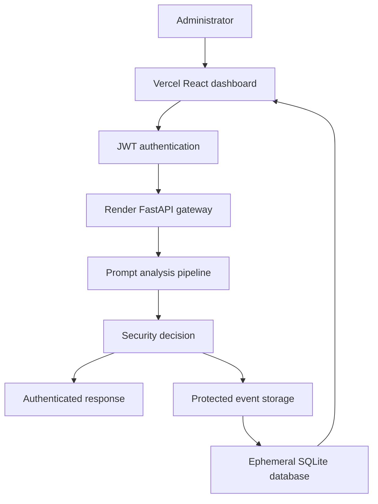
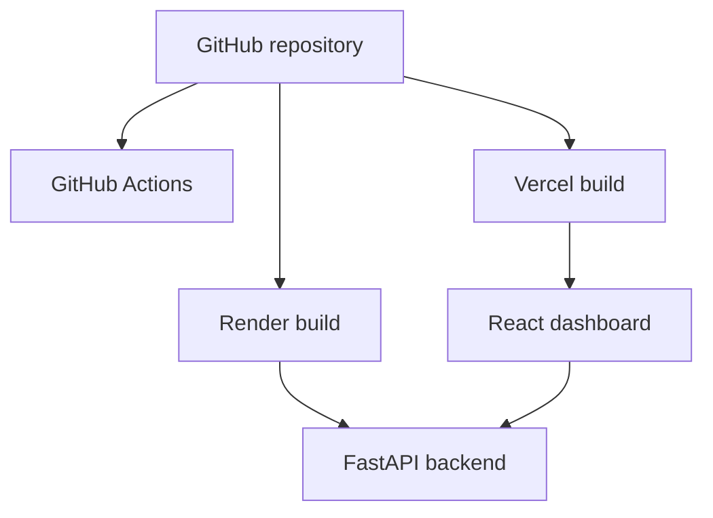
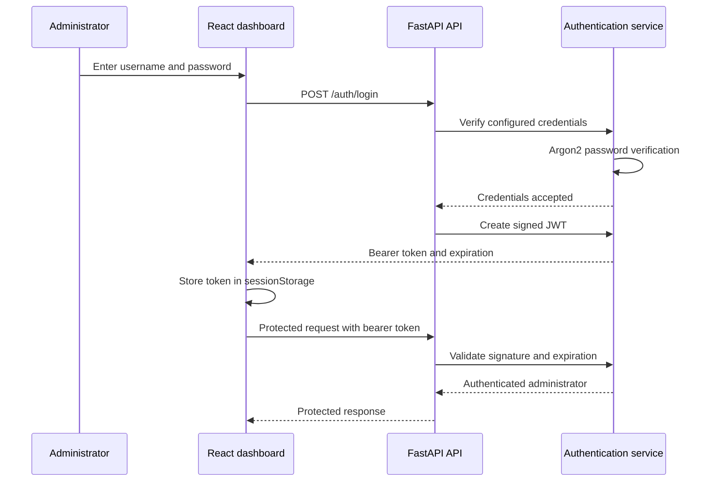
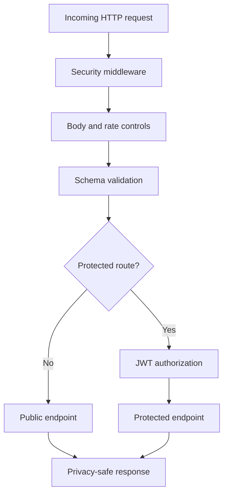
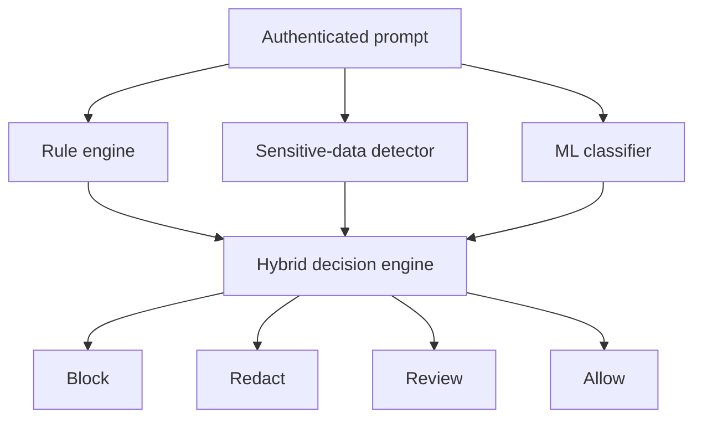
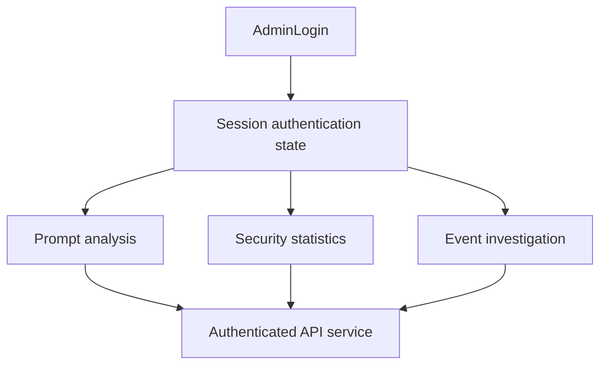
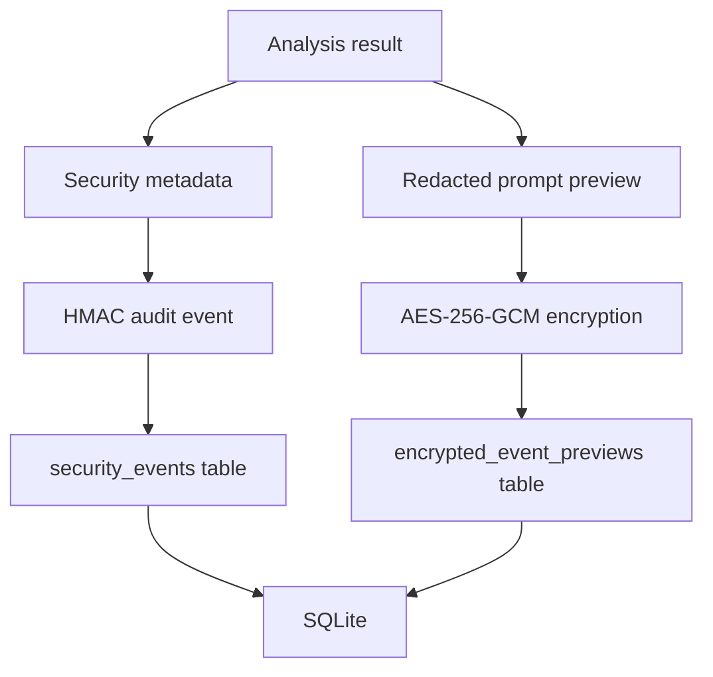
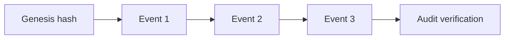
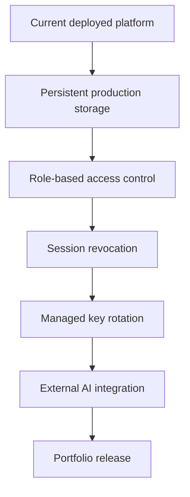

# PromptShield Architecture

## Overview

PromptShield is an authenticated security gateway placed between an administrator-facing frontend and an AI application.

It analyzes prompts before they are forwarded, identifies prompt attacks and sensitive information, generates an explainable security decision, and stores privacy-aware, tamper-evident security records.

The current implementation includes:

- A FastAPI security backend
- A React administrator dashboard
- JWT administrator authentication
- Rule-based prompt-attack detection
- Sensitive-data detection and redaction
- Machine-learning classification
- AES-GCM protected storage
- HMAC audit-chain verification
- SQLite event storage
- Automated backend and frontend testing
- GitHub Actions continuous integration
- A Render backend deployment
- A Vercel frontend deployment

The React frontend is deployed through Vercel and the FastAPI backend is deployed through Render. External AI-provider forwarding and production-grade persistent infrastructure remain future phases.

## Live Deployment

| Component | Platform | Address |
|---|---|---|
| React dashboard | Vercel | [https://prompt-shield-xi.vercel.app](https://prompt-shield-xi.vercel.app) |
| FastAPI backend | Render | [https://promptshield-api-5g1x.onrender.com](https://promptshield-api-5g1x.onrender.com) |
| Health check | Render | [https://promptshield-api-5g1x.onrender.com/health](https://promptshield-api-5g1x.onrender.com/health) |
| API documentation | Render | [https://promptshield-api-5g1x.onrender.com/docs](https://promptshield-api-5g1x.onrender.com/docs) |

The free Render service can enter a sleep state after inactivity. Its first request after sleeping can experience a cold-start delay.

The hosted SQLite database uses an ephemeral filesystem. Hosted event records can reset after a service restart, spin-down or deployment. Local-development storage is unaffected.

## High-Level Architecture



## Deployment Architecture



The deployment uses:

- GitHub as the source repository
- GitHub Actions for automated verification
- Vercel for the Vite and React frontend
- Render for the FastAPI backend
- Vercel environment variables for the public API base URL
- Render environment variables for private backend configuration
- Explicit production CORS origins

The frontend receives only the public backend URL through:

```text
VITE_API_BASE_URL
```

Private cryptographic values are stored only in Render environment settings.

## Authentication Architecture

PromptShield uses a single configured administrator account and signed JWT access tokens.



### Credential protection

The administrator configuration is supplied through private environment variables:

- `PROMPTSHIELD_ADMIN_USERNAME`
- `PROMPTSHIELD_ADMIN_PASSWORD_HASH`
- `PROMPTSHIELD_JWT_SECRET`

The plain administrator password is never stored in the repository or environment file.

Password verification uses Argon2 through `pwdlib`. Username comparison uses constant-time comparison to reduce timing leakage.

### Access tokens

PromptShield access tokens:

- Use the `HS256` JWT algorithm
- Include the authenticated administrator as the subject
- Include issued-at and expiration claims
- Expire after 30 minutes
- Are signed using `PROMPTSHIELD_JWT_SECRET`
- Are required by protected API endpoints

The backend rejects:

- Missing bearer tokens
- Malformed tokens
- Tokens with invalid signatures
- Expired tokens
- Tokens issued for an unexpected subject

### Frontend session handling

After successful login, the React dashboard stores the access token in browser `sessionStorage`.

This provides the following behavior:

- The token is available within the current browser session
- Protected requests automatically include an `Authorization` header
- A `401 Unauthorized` response clears the rejected token
- Expired sessions return the administrator to the login screen
- Selecting **Sign out** removes the token and clears dashboard state
- Closing the browser session removes the session token

The frontend never stores the administrator password.

### Public and protected routes

| Access level | Endpoints |
|---|---|
| Public | `GET /`, `GET /health`, `POST /auth/login` |
| Administrator | `POST /analyze`, `POST /ml/analyze`, `GET /events`, `GET /statistics`, `POST /integrity/verify`, `GET /audit/verify` |

Protected endpoints require:

```text
Authorization: Bearer <access-token>
```

## Request Processing Flow



The middleware, validation and authentication layers provide:

- Request identifiers
- Privacy-safe operational logging
- Defensive HTTP response headers
- Restricted frontend origins
- Request-body size enforcement
- Per-client rate limiting for expensive analysis routes
- Schema and length validation
- Bearer-token authentication
- Privacy-safe error responses

The `/health` endpoint remains public and outside the prompt-analysis rate limit so monitoring systems can check API availability.

## Analysis Pipeline



### Rule engine

The deterministic rule engine detects known patterns associated with:

- Prompt injection
- Jailbreak attempts
- System-prompt extraction
- Role manipulation

Rule-based attack detection has blocking priority.

### Sensitive-data detector

The sensitive-data detector identifies values such as:

- Email addresses
- Phone numbers
- API keys
- Cloud access keys
- GitHub tokens
- Private-key markers
- Password assignments
- High-entropy secret-like strings

Detected values are replaced with `[REDACTED]`.

### Machine-learning classifier

The advisory classifier uses:

- TF-IDF word features
- TF-IDF character features
- Logistic Regression
- Balanced class weights
- Classification threshold `0.55`
- Multiple prompt-security training sources
- Defensive hard-negative examples

An ML-only detection results in `review` rather than automatic blocking.

### Decision priority

| Priority | Condition | Action |
|---:|---|---|
| 1 | Rule-based attack detected | `block` |
| 2 | Sensitive information detected | `redact` |
| 3 | Only ML considers the prompt suspicious | `review` |
| 4 | No security concern detected | `allow` |

## Frontend Architecture



The React frontend includes:

- `AdminLogin` for administrator authentication
- `App` for dashboard orchestration and session state
- `SecurityBreakdown` for action and category visualization
- `RecentEvents` for event filtering, refreshing and investigation
- `api.js` for backend communication and bearer-token handling

The frontend API service is responsible for:

- Public health checks
- Administrator login
- Session-token storage
- Authorization headers
- Prompt-analysis requests
- Statistics retrieval
- Audit verification
- Recent-event retrieval
- Expired-session cleanup

## Data Protection Flow



### Stored event metadata

The `security_events` table stores:

- Creation time
- Malicious or safe classification
- Risk level and score
- Detection category
- Recommended action
- Sensitive-data presence
- Matched rule patterns
- Sensitive-data type names
- Prompt length
- Previous audit hash
- Current event hash

The original unredacted prompt is not stored.

### Encrypted preview storage

The `encrypted_event_previews` table stores:

- Security-event ID
- Random event reference
- AES-256-GCM encrypted redacted preview

The event ID and event reference form authenticated associated data. This prevents encrypted previews from being silently exchanged between events.

There is intentionally no public preview-decryption endpoint.

## Tamper-Evident Audit Chain



Each protected event hash covers:

- Protected event metadata
- The previous event hash
- The configured HMAC key

Changing an existing event, changing its audit hash or rearranging the chain causes verification to fail.

`BEGIN IMMEDIATE` protects audit-chain writes from concurrent branching.

## Database Reliability

PromptShield configures SQLite with:

| Control | Purpose |
|---|---|
| Foreign keys | Enforce relationships between events and previews |
| Five-second timeout | Wait briefly for database locks |
| Busy timeout | Reduce immediate lock failures |
| WAL mode | Improve concurrent reading and writing |
| Normal synchronization | Provide suitable WAL safety and performance |
| Context-managed transactions | Commit successful writes and roll back failures |
| Quick check | Detect SQLite consistency problems |
| Foreign-key check | Detect invalid table relationships |
| Startup verification | Refuse startup when integrity verification fails |

These controls protect database consistency, but they do not make SQLite persistent on Render's free ephemeral filesystem.

## Cryptographic Components

| Component | Algorithm | Purpose |
|---|---|---|
| Administrator password | Argon2 | Protect configured administrator credentials |
| Access token | JWT with HS256 | Authenticate protected API requests |
| Message integrity | HMAC-SHA-256 | Verify trusted prompts or messages |
| Audit chain | HMAC-SHA-256 | Detect modified stored events |
| Preview encryption | AES-256-GCM | Protect redacted prompt previews |
| Username and signature comparison | Constant-time comparison | Reduce timing leakage |

JWT, AES and HMAC secrets are supplied through private environment variables and excluded from Git.

## API Components

| Endpoint | Access | Component |
|---|---|---|
| `GET /` | Public | Application status |
| `GET /health` | Public | Application health |
| `POST /auth/login` | Public | Administrator authentication and JWT issuance |
| `POST /analyze` | Administrator | Complete hybrid analysis |
| `POST /ml/analyze` | Administrator | Standalone ML inference |
| `POST /integrity/verify` | Administrator | HMAC verification |
| `GET /events` | Administrator | Recent event metadata |
| `GET /statistics` | Administrator | Aggregated event statistics |
| `GET /audit/verify` | Administrator | Audit-chain validation |

## Main Backend Modules

| Module | Responsibility |
|---|---|
| `main.py` | FastAPI application and endpoint orchestration |
| `schemas.py` | Request and response validation |
| `auth_service.py` | Password verification and JWT operations |
| `auth_dependencies.py` | Bearer-token enforcement for protected routes |
| `detector.py` | Deterministic prompt-attack detection |
| `sensitive_detector.py` | Sensitive-data detection and redaction |
| `ml_detector.py` | Saved-model loading and inference |
| `database.py` | Storage, statistics and database integrity |
| `audit_service.py` | Audit-event hashing and verification |
| `encryption_service.py` | AES-256-GCM encryption and decryption |
| `integrity_service.py` | HMAC message signing and verification |
| `config.py` | Environment configuration validation |
| `error_handlers.py` | Privacy-safe API errors |
| `request_controls.py` | Request-body size enforcement |
| `rate_limiter.py` | Sliding-window rate limiting |
| `security_headers.py` | Defensive HTTP response headers |
| `request_logging.py` | Privacy-safe request metadata logging |

## Main Frontend Modules

| Module | Responsibility |
|---|---|
| `App.jsx` | Dashboard orchestration, session state and logout |
| `AdminLogin.jsx` | Administrator sign-in interface |
| `RecentEvents.jsx` | Event search, filtering, refresh and investigation |
| `SecurityBreakdown.jsx` | Action and category visualizations |
| `services/api.js` | API requests, token storage and authorization headers |
| `App.css` | Dashboard and authentication presentation |

## Trust Boundaries

PromptShield has four primary trust boundaries.

### 1. Administrator browser to authentication endpoint

The submitted username and password are treated as untrusted input.

The backend:

- Validates the login request schema
- Compares the username safely
- Verifies the Argon2 password hash
- Returns only a signed, expiring access token

### 2. Authenticated browser to protected API

Bearer tokens are treated as security credentials.

The backend:

- Verifies the JWT signature
- Verifies token expiration
- Verifies the expected administrator subject
- Rejects missing or invalid authentication

### 3. Application to storage

Original sensitive values are excluded. Redacted previews are encrypted and event metadata is authenticated through the audit chain.

### 4. Deployment environment to security services

JWT, HMAC and AES keys, along with the administrator password hash, are stored as private environment variables.

These values must never be added to:

- Git
- GitHub
- `render.yaml`
- Vercel frontend variables
- Screenshots
- Public logs

## Configuration Validation

Application startup validates:

- HMAC key availability and minimum length
- AES-256 key validity
- JWT signing-secret availability and minimum length
- Administrator username availability
- Administrator Argon2 password-hash validity
- ML model availability
- Rate-limit configuration
- Database consistency and foreign-key integrity

PromptShield refuses normal startup when required security configuration is invalid.

## Testing Architecture

The backend test suite covers authentication independently and through the API.

Authentication-related backend tests include:

- Password hashing and verification
- Valid and invalid credentials
- JWT creation
- JWT decoding
- Invalid signatures
- Expired tokens
- Missing authorization
- Protected endpoint access
- Public endpoint availability
- Authentication configuration validation

The frontend test suite covers:

- Login form rendering
- Successful login
- Login failures
- Token storage
- Authorization headers
- Missing-session behavior
- Expired-session cleanup
- Dashboard access after login
- Logout and dashboard-state clearing

The current automated-test totals are:

| Suite | Passing tests |
|---|---:|
| Backend | 149 |
| Frontend | 31 |
| Total | 180 |

## Current Limitations

- Authentication supports one configured administrator instead of multi-user role-based access control.
- Access tokens use fixed expiration without refresh-token rotation.
- There is no centralized session-revocation store.
- The rate limiter is stored in process memory.
- Multiple server processes would not share rate-limit state.
- The free Render backend can experience a cold-start delay.
- The free Render filesystem is ephemeral, so hosted SQLite events can reset.
- SQLite is intended for local or small-scale use.
- Production key rotation is not implemented.
- The audit chain is not coordinated across distributed databases.
- External AI-provider forwarding is not yet implemented.
- The project has not undergone an independent penetration test.
- The ML classifier remains probabilistic and cannot detect every unseen attack.

## Planned Evolution



Planned improvements include:

- Persistent production storage
- Multi-user role-based access control
- Refresh-token rotation
- Centralized session revocation
- Shared production rate limiting
- Managed secret storage and key rotation
- Additional multilingual and obfuscated-attack evaluation
- External AI-provider forwarding
- Independent security testing
- Portfolio screenshots and demonstration material