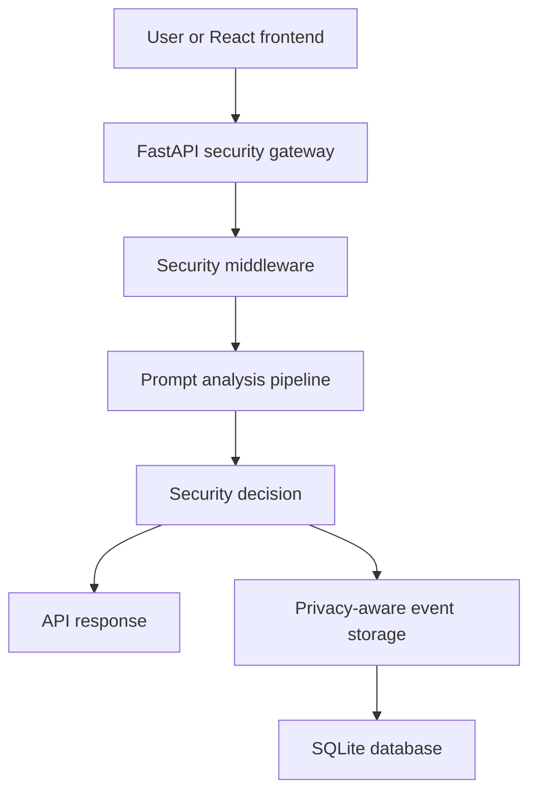
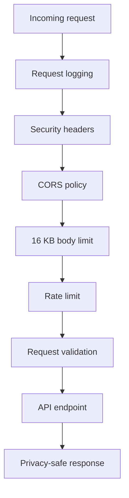
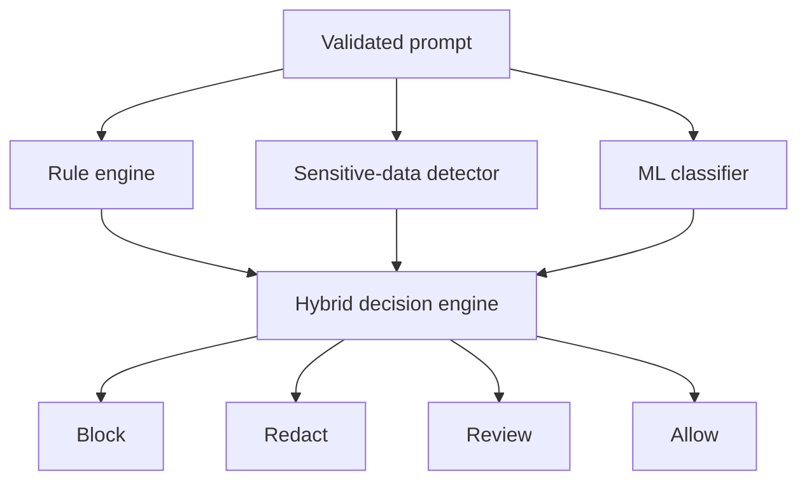
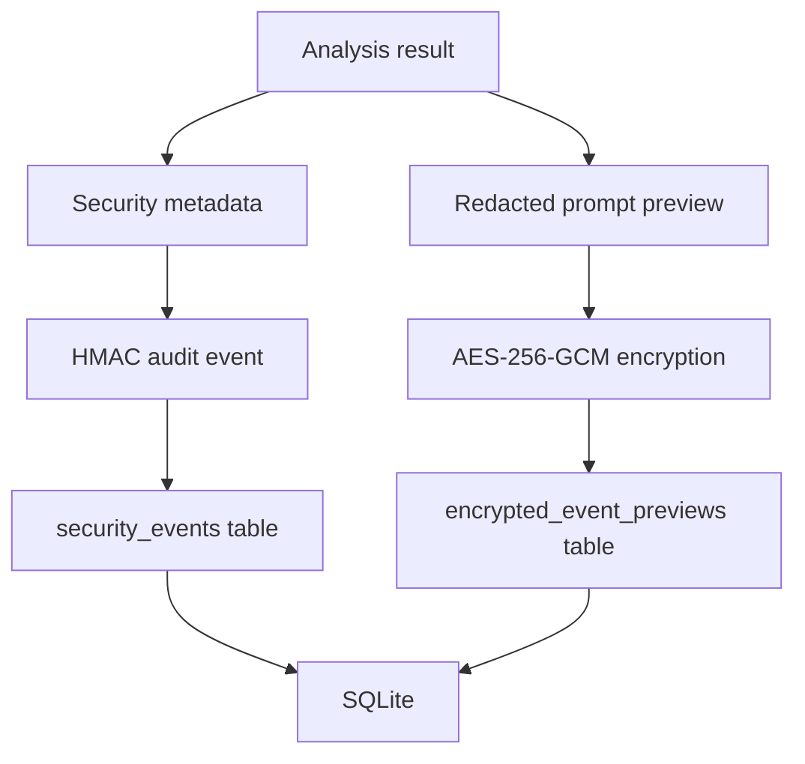
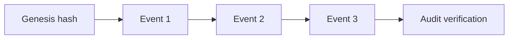
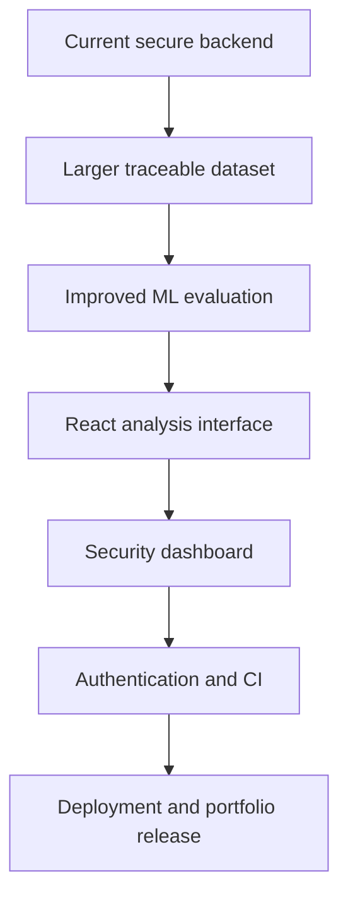

# PromptShield Architecture

## Overview

PromptShield is a security gateway placed between a user or frontend application and an AI system.

It analyzes prompts before they are forwarded, identifies attacks and sensitive information, generates an explainable decision, and stores privacy-aware security records.

The current implementation is a local backend foundation. The React frontend and external AI-provider integration are planned phases.

## High-Level Architecture

## Request Processing Flow

The middleware and validation layers provide:

- Request identifiers
- Privacy-safe operational logging
- Defensive HTTP response headers
- Restricted frontend origins
- Request-body size enforcement
- Per-client rate limiting
- Schema and length validation
- Privacy-safe error responses

## Analysis Pipeline

### Rule engine

The deterministic rule engine detects known patterns associated with:

- Prompt injection
- Jailbreak attempts
- System-prompt extraction
- Role manipulation

Rule-based attack detection has blocking priority.

### Sensitive-data detector

The sensitive-data detector identifies values such as:

- Email addresses
- Phone numbers
- API keys
- Cloud access keys
- GitHub tokens
- Private-key markers
- Password assignments
- High-entropy secret-like strings

Detected values are replaced with `[REDACTED]`.

### Machine-learning classifier

The advisory classifier uses:

- TF-IDF word features
- TF-IDF character features
- Logistic Regression
- Balanced class weights
- A provisional probability threshold of `0.55`

An ML-only detection results in `review`, rather than automatic blocking.

### Decision priority

| Priority | Condition | Action |
|---:|---|---|
| 1 | Rule-based attack detected | `block` |
| 2 | Sensitive information detected | `redact` |
| 3 | Only ML considers the prompt suspicious | `review` |
| 4 | No security concern detected | `allow` |

## Data Protection Flow

### Stored event metadata

The `security_events` table stores:

- Creation time
- Malicious or safe classification
- Risk level and score
- Detection category
- Recommended action
- Sensitive-data presence
- Matched rule patterns
- Sensitive-data type names
- Prompt length
- Previous audit hash
- Current event hash

The original unredacted prompt is not stored.

### Encrypted preview storage

The `encrypted_event_previews` table stores:

- Security-event ID
- Random event reference
- AES-256-GCM encrypted redacted preview

The event ID and event reference form authenticated associated data. This prevents encrypted previews from being silently exchanged between events.

There is intentionally no public preview-decryption endpoint.

## Tamper-Evident Audit Chain

Each protected event hash covers:

- The protected event metadata
- The previous event hash
- The configured HMAC key

Changing an existing event, changing its audit hash, or rearranging the chain causes verification to fail.

`BEGIN IMMEDIATE` protects audit-chain writes from concurrent branching.

## Database Reliability

PromptShield configures SQLite with:

| Control | Purpose |
|---|---|
| Foreign keys | Enforce relationships between events and previews |
| Five-second timeout | Wait briefly for database locks |
| Busy timeout | Reduce immediate lock failures |
| WAL mode | Improve concurrent reading and writing |
| Normal synchronization | Provide suitable WAL safety and performance |
| Context-managed transactions | Commit successful writes and roll back failures |
| Quick check | Detect SQLite consistency problems |
| Foreign-key check | Detect invalid table relationships |
| Startup verification | Refuse startup when integrity verification fails |

## Cryptographic Components

| Component | Algorithm | Purpose |
|---|---|---|
| Message integrity | HMAC-SHA-256 | Verify trusted prompts or messages |
| Audit chain | HMAC-SHA-256 | Detect modified stored events |
| Preview encryption | AES-256-GCM | Protect redacted prompt previews |
| Signature comparison | Constant-time comparison | Reduce timing leakage |

Encryption keys and HMAC keys are supplied through environment variables and are excluded from Git.

## API Components

| Endpoint | Component |
|---|---|
| `POST /analyze` | Complete hybrid analysis |
| `POST /ml/analyze` | Standalone ML inference |
| `POST /integrity/verify` | HMAC verification |
| `GET /events` | Recent event metadata |
| `GET /statistics` | Aggregated event statistics |
| `GET /audit/verify` | Audit-chain validation |
| `GET /health` | Application health |
| `GET /` | Application status |

## Main Backend Modules

| Module | Responsibility |
|---|---|
| `main.py` | FastAPI application and endpoint orchestration |
| `schemas.py` | Request and response validation |
| `detector.py` | Deterministic prompt-attack detection |
| `sensitive_detector.py` | Sensitive-data detection and redaction |
| `ml_detector.py` | Saved-model loading and inference |
| `database.py` | Storage, statistics and database integrity |
| `audit_service.py` | Audit-event hashing and verification |
| `encryption_service.py` | AES-256-GCM encryption and decryption |
| `integrity_service.py` | HMAC message signing and verification |
| `config.py` | Environment configuration validation |
| `error_handlers.py` | Privacy-safe API errors |
| `request_controls.py` | Request-body size enforcement |
| `rate_limiter.py` | Sliding-window rate limiting |
| `security_headers.py` | Defensive HTTP response headers |
| `request_logging.py` | Privacy-safe request metadata logging |

## Trust Boundaries

PromptShield currently has three main trust boundaries:

1. **External client to API**  
   All input is treated as untrusted and passes through size, rate, schema and security checks.

2. **Application to storage**  
   Original sensitive values are excluded. Redacted previews are encrypted, and event metadata is authenticated.

3. **Environment to cryptographic services**  
   HMAC and AES keys are loaded from private environment configuration and must never enter source control.

## Current Limitations

- The ML dataset is small and manually constructed.
- The rate limiter is stored in process memory.
- Multiple server processes would not share rate-limit state.
- SQLite is intended for local or small-scale use.
- Authentication and authorization are not implemented.
- Production key rotation is not implemented.
- The audit chain is not coordinated across distributed databases.
- External AI-provider forwarding is not yet implemented.
- The React dashboard is not yet implemented.
- The project has not undergone an independent penetration test.

## Planned Evolution

