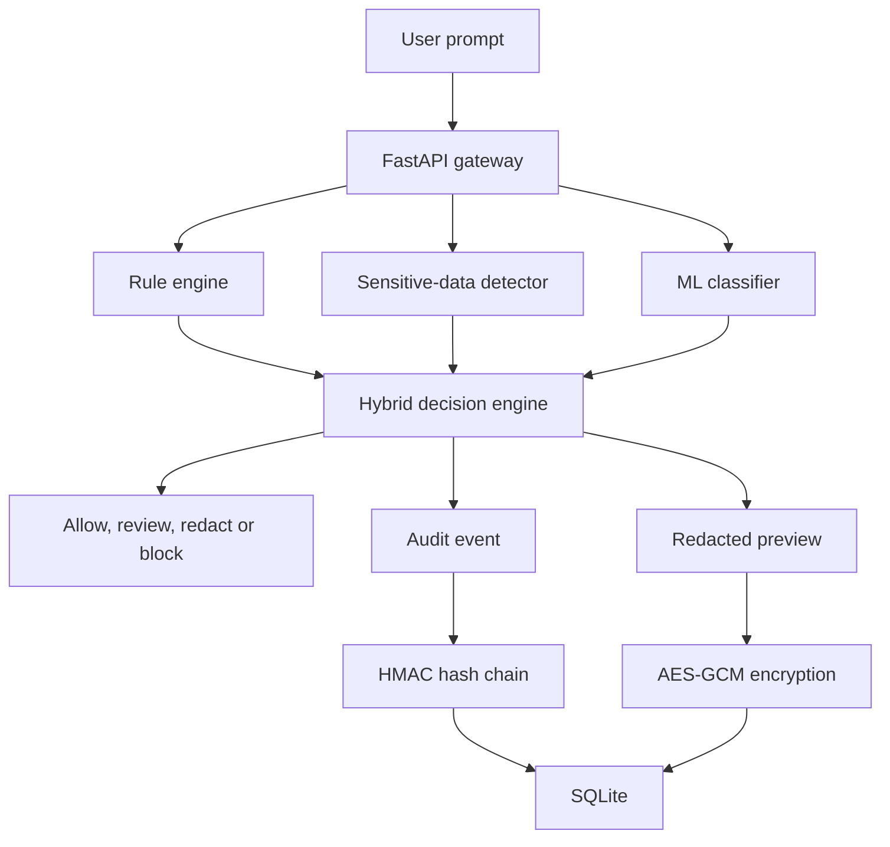

# PromptShield

PromptShield is an explainable security gateway that analyzes user prompts before they reach an AI application. It combines deterministic security rules, sensitive-data detection, machine learning, cryptographic protection and tamper-evident logging.

## Project Status

The backend security foundation and expanded machine-learning pipeline are operational.

- 123 automated tests passing
- Hybrid rule-based and machine-learning detection
- Sensitive-data detection and redaction
- HMAC-SHA-256 integrity verification
- AES-256-GCM encrypted storage
- Tamper-evident SQLite audit chain
- Multi-source ML training and independent evaluation
- API rate limiting and request-size protection
- CORS, security headers and privacy-safe error handling
- React dashboard planned

## Features

### Prompt attack detection

PromptShield detects patterns associated with:

- Prompt injection
- Jailbreak attempts
- System-prompt extraction
- Role manipulation

The rule engine returns:

- Attack category
- Risk score and level
- Matched patterns
- Human-readable explanation
- Recommended action

### Sensitive-data protection

The sensitive-data detector recognizes:

- Email addresses
- Phone numbers
- API keys
- AWS access keys
- Private-key indicators
- Password and secret assignments
- High-entropy secret-like strings

Sensitive values are replaced with `[REDACTED]` before protected previews are stored.

### Hybrid machine-learning detection

PromptShield includes a TF-IDF and Logistic Regression classifier using:

- Word n-grams
- Character n-grams
- Balanced classification weights
- Multiple prompt-security datasets
- Defensive hard-negative examples
- A configurable classification threshold

The main `/analyze` endpoint combines deterministic security rules, sensitive-data detection and machine-learning output.

Decision priority:

1. Rule-based attack: `block`
2. Sensitive data: `redact`
3. ML-only suspicion: `review`
4. No detection: `allow`

The machine-learning model is advisory. A rule-based attack still receives blocking priority.

### ML datasets

The production classifier is trained using:

- The original PromptShield development dataset
- Defensive and educational hard-negative prompts
- NeurAlchemy prompt-injection training data
- A reserved portion of the deepset training data

Independent validation and testing use records that are kept separate from production training.

Dataset origins, licenses, transformations and limitations are documented in [`DATASET_SOURCES.md`](DATASET_SOURCES.md).

### ML evaluation

Current production training configuration:

- 4,944 combined training samples
- 110 reserved deepset validation samples
- Duplicate prompt removal
- Production classification threshold: `0.55`
- TF-IDF word and character features
- Balanced Logistic Regression classifier

Current expanded-model test results:

| Dataset | Accuracy | Precision | Recall | F1 score | ROC-AUC |
|---|---:|---:|---:|---:|---:|
| NeurAlchemy test | 95.44% | 96.53% | 95.65% | 96.09% | 0.9943 |
| deepset test | 78.45% | 94.87% | 61.67% | 74.75% | 0.8920 |
| PromptShield challenge | 80.00% | 71.43% | 100.00% | 83.33% | 0.9500 |

The expanded model performs substantially better across external datasets than the original 80-prompt baseline. Performance still varies between datasets, demonstrating the importance of domain diversity and independent evaluation.

These results represent an academic and portfolio evaluation. They should not be interpreted as production-level security guarantees.

### HMAC integrity verification

PromptShield uses HMAC-SHA-256 to verify that trusted messages and system prompts have not been modified.

Signature verification uses constant-time comparison to reduce timing-attack risk.

### AES-GCM protected storage

Redacted prompt previews are encrypted using AES-256-GCM before being stored in SQLite.

The protected-storage design provides:

- Confidentiality
- Ciphertext integrity
- Random nonce generation
- Event-specific authenticated context
- Detection of modified ciphertext
- Protection against ciphertext swapping

Original sensitive values are not stored. There is intentionally no public decryption endpoint.

### Tamper-evident audit chain

Every security event contains:

- The previous event hash
- Its own HMAC-SHA-256 event hash

Changing or rearranging protected event data breaks the chain and can be detected through the audit-verification API.

### Privacy-aware event storage

PromptShield stores security metadata such as:

- Risk level and score
- Attack category
- Recommended action
- Matched rule names
- Detection sources
- ML probability
- Detected sensitive-data types
- Prompt length
- Audit hashes
- Encrypted redacted preview

It does not store the original unredacted prompt.

### API hardening

The API includes:

- Configurable CORS restrictions
- Request-body size enforcement
- Sliding-window rate limiting
- Security response headers
- Privacy-safe validation errors
- Privacy-safe request logging
- Startup configuration validation
- Safe handling of unexpected server errors

### Database hardening

SQLite storage uses:

- Foreign-key enforcement
- Write-ahead logging
- Busy-timeout configuration
- Explicit write transactions
- Audit-chain verification
- Startup integrity checks
- Isolated temporary databases during testing

## Architecture



A more detailed design is available in [`ARCHITECTURE.md`](ARCHITECTURE.md).

## API Endpoints

| Method | Endpoint | Purpose |
|---|---|---|
| GET | `/` | Application status |
| GET | `/health` | Health check |
| POST | `/analyze` | Hybrid prompt and sensitive-data analysis |
| POST | `/ml/analyze` | Standalone ML classification |
| GET | `/events` | Recent security events |
| GET | `/statistics` | Security statistics |
| POST | `/integrity/verify` | HMAC-SHA-256 verification |
| GET | `/audit/verify` | Audit-chain verification |

Interactive API documentation is available at:

```text
http://127.0.0.1:8000/docs
```

## Technology Stack

### Implemented

- Python
- FastAPI
- Pydantic
- SQLite
- scikit-learn
- Hugging Face Datasets
- pytest
- HMAC-SHA-256
- AES-256-GCM
- python-dotenv

### Planned

- React
- Vite
- GitHub Actions
- Cloud deployment

## Project Structure

```text
PromptShield/
├── backend/
│   ├── data/
│   │   ├── external/
│   │   │   ├── deepset_train.csv
│   │   │   ├── deepset_test.csv
│   │   │   ├── neuralchemy_core_train.csv
│   │   │   ├── neuralchemy_core_validation.csv
│   │   │   ├── neuralchemy_core_test.csv
│   │   │   └── validation_report.json
│   │   ├── prompts.csv
│   │   ├── challenge_prompts.csv
│   │   └── hard_negative_prompts.csv
│   ├── models/
│   │   ├── prompt_classifier.joblib
│   │   ├── metrics.json
│   │   ├── challenge_metrics.json
│   │   └── model_comparison.json
│   ├── tests/
│   ├── audit_service.py
│   ├── config.py
│   ├── database.py
│   ├── detector.py
│   ├── encryption_service.py
│   ├── error_handlers.py
│   ├── evaluate_model.py
│   ├── evaluate_thresholds.py
│   ├── integrity_service.py
│   ├── main.py
│   ├── ml_detector.py
│   ├── model_pipeline.py
│   ├── prepare_external_datasets.py
│   ├── rate_limiter.py
│   ├── schemas.py
│   ├── sensitive_detector.py
│   ├── train_expanded_model.py
│   ├── train_model.py
│   ├── validate_external_datasets.py
│   └── requirements.txt
├── .gitignore
├── ARCHITECTURE.md
├── DATASET_SOURCES.md
└── README.md
```

## Local Setup

### 1. Clone the repository

```powershell
git clone https://github.com/sreemanbondada-sudo/PromptShield.git
cd PromptShield\backend
```

### 2. Create a virtual environment

```powershell
py -m venv .venv
```

Activate it in PowerShell:

```powershell
Set-ExecutionPolicy -Scope Process -ExecutionPolicy Bypass
.\.venv\Scripts\Activate.ps1
```

### 3. Install dependencies

```powershell
python -m pip install -r requirements.txt
```

### 4. Configure environment variables

Create `backend/.env` based on `.env.example`.

Generate an HMAC key:

```powershell
python -c "import secrets; print(secrets.token_urlsafe(32))"
```

Generate a Base64-encoded AES-256 key:

```powershell
python -c "import base64, secrets; print(base64.urlsafe_b64encode(secrets.token_bytes(32)).decode())"
```

Add the generated values to `.env`:

```env
PROMPTSHIELD_HMAC_KEY=your-private-hmac-key
PROMPTSHIELD_AES_KEY=your-base64-encoded-aes-key
PROMPTSHIELD_ALLOWED_ORIGINS=http://localhost:5173,http://127.0.0.1:5173
```

Never commit `.env` or share its secret values.

### 5. Prepare external datasets

The normalized external CSV files are included in the repository. To regenerate them from their documented sources, run:

```powershell
python prepare_external_datasets.py
python validate_external_datasets.py
```

See [`DATASET_SOURCES.md`](DATASET_SOURCES.md) before redistributing or replacing datasets.

### 6. Train the production ML model

```powershell
python train_model.py
```

The command trains the expanded multi-source classifier and writes:

```text
models/prompt_classifier.joblib
models/metrics.json
```

### 7. Evaluate the model

```powershell
python evaluate_model.py
python evaluate_thresholds.py
```

### 8. Run the tests

Run tests from the `backend` directory:

```powershell
python -m pytest -v
```

Current result:

```text
123 passed
```

### 9. Start the API

```powershell
python -m uvicorn main:app --reload
```

Open:

```text
http://127.0.0.1:8000/docs
```

## Testing

The automated test suite covers:

- Rule-based attack detection
- Safe-prompt handling
- Sensitive-data detection
- Secret redaction
- Entropy analysis
- FastAPI endpoints
- SQLite storage and statistics
- HMAC generation and verification
- AES-GCM encryption and decryption
- Ciphertext tampering
- Ciphertext-swapping protection
- Audit-chain verification
- ML inference
- Hybrid decision priority
- External-dataset preparation and validation
- Expanded ML training behavior
- Configuration validation
- CORS enforcement
- Request-size enforcement
- Rate-limit enforcement
- Security response headers
- Privacy-safe errors and logging
- Database concurrency protection
- Startup database integrity checks
- Temporary test-database isolation

Current result:

```text
123 passed
```

One dependency deprecation warning may appear from FastAPI's current `TestClient` integration. It does not indicate a failed test.

## Security Limitations

PromptShield is currently an academic and portfolio project.

Current limitations include:

- External-dataset performance varies across domains
- The classifier currently performs binary safe/malicious classification
- Multilingual, encoded and heavily obfuscated attacks need further evaluation
- Rule patterns require continued maintenance against new attacks
- Rate limiting currently uses in-memory application state
- No user authentication or authorization
- No production key-management service
- No distributed or multi-instance rate-limit storage
- No public encrypted-preview retrieval workflow
- SQLite is intended for local development
- The ML classifier may produce false positives and false negatives

Do not use the current version as the only security control protecting a production AI system.

## Roadmap

- Add user authentication and authorization
- Build the React security dashboard
- Add charts for actions, risks and attack categories
- Add a security-event investigation interface
- Expand multilingual and obfuscated attack evaluation
- Add stronger final holdout datasets
- Replace in-memory rate limiting for distributed deployment
- Add GitHub Actions continuous integration
- Deploy the backend and frontend
- Add dashboard screenshots and demonstration material

## Responsible Use

PromptShield is designed for defensive security research, education and portfolio demonstration. Dataset examples and detection rules should be used only to improve the security of authorized AI applications.

## Author

Sreeman Bondada