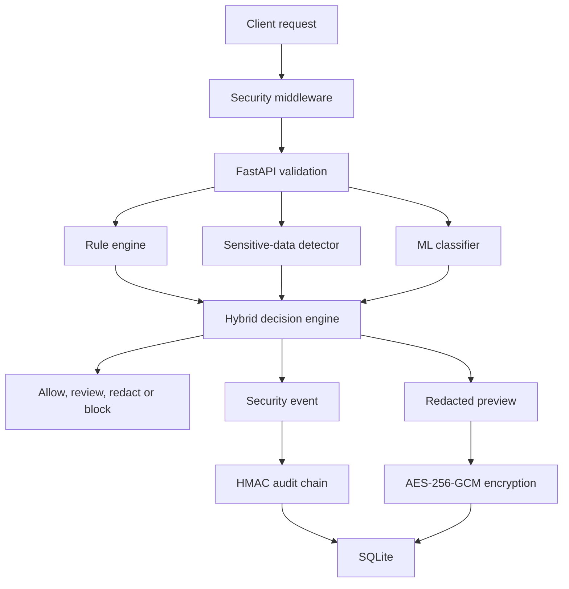

# PromptShield

PromptShield is an explainable security gateway that analyzes user prompts before they reach an AI application. It combines deterministic security rules, sensitive-data detection, machine learning, cryptographic protection, privacy-aware storage and tamper-evident auditing.

## Project Status

The backend security foundation and backend-hardening phase are operational.

- 118 automated tests passing
- Hybrid rule-based and machine-learning detection
- Sensitive-data detection and redaction
- Explainable security decisions
- HMAC-SHA-256 integrity verification
- AES-256-GCM encrypted preview storage
- Tamper-evident SQLite audit chain
- Request-size and rate-limit protection
- Privacy-safe errors and request logging
- Database reliability and integrity checks
- Independent ML challenge evaluation
- React dashboard planned

## Features

### Prompt-attack detection

PromptShield detects patterns associated with:

- Prompt injection
- Jailbreak attempts
- System-prompt extraction
- Role manipulation

The rule engine returns:

- Attack category
- Risk score and level
- Matched patterns
- Human-readable explanation
- Recommended action

### Sensitive-data protection

The sensitive-data detector recognizes:

- Email addresses
- Phone numbers
- API keys
- AWS access keys
- GitHub tokens
- Private-key indicators
- Password and secret assignments
- High-entropy secret-like strings

Sensitive values are replaced with `[REDACTED]` before protected preview storage.

### Hybrid machine-learning detection

PromptShield includes a TF-IDF and Logistic Regression classifier using:

- Word n-grams
- Character n-grams
- Balanced classification weights
- A configurable classification threshold

The main `/analyze` endpoint combines deterministic rules, sensitive-data detection and machine-learning output.

Decision priority:

1. Rule-based attack: `block`
2. Sensitive data: `redact`
3. ML-only suspicion: `review`
4. No detection: `allow`

The ML model remains advisory because the current dataset is small.

### Machine-learning evaluation

Current development datasets:

- 80 labelled training and development prompts
- 20 independent challenge prompts
- Provisional classification threshold: `0.55`

Current challenge-set results:

- Accuracy: 90.00%
- Precision: 83.33%
- Recall: 100.00%
- F1 score: 90.91%

These results represent an early validation baseline and should not be interpreted as production-level performance.

### HMAC integrity verification

PromptShield uses HMAC-SHA-256 to verify that trusted messages and system prompts have not been modified.

Signature verification uses constant-time comparison to reduce timing-attack risk.

### AES-GCM protected storage

Redacted prompt previews are encrypted using AES-256-GCM before being stored in SQLite.

The protected-storage design provides:

- Confidentiality
- Ciphertext integrity
- Random nonce generation
- Event-specific authenticated context
- Detection of modified ciphertext
- Protection against ciphertext swapping

Original sensitive values are not stored. There is intentionally no public decryption endpoint.

### Tamper-evident audit chain

Every protected security event contains:

- The previous event hash
- Its own HMAC-SHA-256 event hash

Changing or rearranging protected event data breaks the chain and can be detected through the audit-verification API.

### Privacy-aware event storage

PromptShield stores security metadata such as:

- Risk level and score
- Attack category
- Recommended action
- Matched rule names
- Detected sensitive-data types
- Detection sources
- ML prediction and probability
- Prompt length
- Audit hashes

It does not store the original unredacted prompt.

### API protection

PromptShield includes:

- Pydantic request validation
- A 16 KB request-body limit
- Configurable sliding-window rate limiting
- Restricted CORS origins
- Browser security response headers
- Privacy-safe error responses
- Privacy-safe operational logging
- Request identifiers
- Startup configuration validation

The default rate limit permits 30 analysis requests per client during a 60-second window.

### Database reliability

SQLite reliability controls include:

- Foreign-key enforcement
- Write-ahead logging
- Busy timeout handling
- Explicit audit-chain write transactions
- Automatic rollback through context-managed transactions
- SQLite quick integrity checks
- Foreign-key consistency checks
- Startup refusal when database integrity verification fails

## Architecture

A detailed technical design is available in [ARCHITECTURE.md](ARCHITECTURE.md).



The middleware layer provides:

1. Privacy-safe request logging
2. Security response headers
3. Restricted CORS handling
4. Request-body size enforcement
5. Per-client analysis rate limiting
6. Privacy-safe error handling

## API Endpoints

| Method | Endpoint | Purpose |
|---|---|---|
| GET | `/` | Application status |
| GET | `/health` | Health check |
| POST | `/analyze` | Hybrid prompt and sensitive-data analysis |
| POST | `/ml/analyze` | Standalone ML classification |
| GET | `/events` | Recent security-event metadata |
| GET | `/statistics` | Aggregated security statistics |
| POST | `/integrity/verify` | HMAC-SHA-256 message verification |
| GET | `/audit/verify` | Tamper-evident audit-chain verification |

Interactive API documentation is available locally at:

```text
http://127.0.0.1:8000/docs
```

## Technology Stack

### Implemented

- Python
- FastAPI
- Pydantic
- SQLite
- scikit-learn
- pytest
- HMAC-SHA-256
- AES-256-GCM
- python-dotenv

### Planned

- React
- Vite
- GitHub Actions
- Cloud deployment

## Project Structure

```text
PromptShield/
|-- backend/
|   |-- data/
|   |   |-- prompts.csv
|   |   `-- challenge_prompts.csv
|   |-- models/
|   |   |-- prompt_classifier.joblib
|   |   |-- metrics.json
|   |   `-- challenge_metrics.json
|   |-- tests/
|   |-- audit_service.py
|   |-- config.py
|   |-- database.py
|   |-- detector.py
|   |-- encryption_service.py
|   |-- error_handlers.py
|   |-- evaluate_model.py
|   |-- evaluate_thresholds.py
|   |-- integrity_service.py
|   |-- main.py
|   |-- ml_detector.py
|   |-- rate_limiter.py
|   |-- request_controls.py
|   |-- request_logging.py
|   |-- schemas.py
|   |-- security_headers.py
|   |-- sensitive_detector.py
|   |-- train_model.py
|   `-- requirements.txt
|-- .gitignore
`-- README.md
```

## Local Setup

### 1. Clone the repository

```powershell
git clone https://github.com/sreemanbondada-sudo/PromptShield.git
cd PromptShield\backend
```

### 2. Create a virtual environment

```powershell
py -m venv .venv
```

Activate it in PowerShell:

```powershell
Set-ExecutionPolicy -Scope Process -ExecutionPolicy Bypass
.\.venv\Scripts\Activate.ps1
```

### 3. Install dependencies

```powershell
python -m pip install -r requirements.txt
```

### 4. Configure environment variables

Create `backend/.env` based on `backend/.env.example`.

Generate an HMAC key:

```powershell
python -c "import secrets; print(secrets.token_urlsafe(32))"
```

Generate a Base64-encoded AES-256 key:

```powershell
python -c "import base64, secrets; print(base64.urlsafe_b64encode(secrets.token_bytes(32)).decode())"
```

Example configuration:

```env
PROMPTSHIELD_HMAC_KEY=your-private-hmac-key
PROMPTSHIELD_AES_KEY=your-base64-encoded-aes-key
PROMPTSHIELD_ALLOWED_ORIGINS=http://localhost:5173,http://127.0.0.1:5173
PROMPTSHIELD_RATE_LIMIT_MAX_REQUESTS=30
PROMPTSHIELD_RATE_LIMIT_WINDOW_SECONDS=60
```

Never commit `.env` or share its secret values.

### 5. Train the ML model

```powershell
python train_model.py
```

### 6. Evaluate the model

```powershell
python evaluate_model.py
python evaluate_thresholds.py
```

### 7. Run the tests

Run tests from the `backend` directory:

```powershell
python -m pytest -v
```

Current verified result:

```text
118 passed
```

### 8. Start the API

```powershell
python -m uvicorn main:app --reload
```

Open:

```text
http://127.0.0.1:8000/docs
```

## Security Design

PromptShield follows these principles:

- Do not store original unredacted prompts.
- Do not echo sensitive request data in error responses.
- Do not log request or response bodies.
- Treat ML output as advisory.
- Give deterministic security rules blocking priority.
- Encrypt redacted previews before storage.
- Authenticate encrypted previews using event-specific context.
- Cryptographically link stored security events.
- Validate secrets, model files and storage during startup.
- Restrict expensive endpoints against oversized and repeated requests.

## Security Limitations

PromptShield is currently an academic and portfolio project.

Current limitations include:

- Small, manually constructed ML datasets
- No user authentication or authorization
- In-memory rate limiting that is not shared between multiple server processes
- No production secrets-management or key-rotation service
- No public encrypted-preview retrieval workflow
- SQLite is intended for local and small-scale deployment
- No distributed audit-chain coordination
- Detection rules require continued evaluation against new attacks
- The system has not undergone an independent penetration test

Do not use the current version as the only security control protecting a production AI system.

## Testing

The test suite covers:

- Rule-based prompt-attack detection
- Safe-prompt handling
- Sensitive-data detection
- Secret redaction
- Entropy analysis
- FastAPI endpoints
- Hybrid decision priority
- SQLite storage and statistics
- Encrypted preview storage
- HMAC generation and verification
- AES-GCM encryption and decryption
- Ciphertext tampering
- Ciphertext-swapping protection
- Audit-chain verification
- ML inference
- Configuration validation
- CORS restrictions
- Privacy-safe errors
- Request-body size protection
- API rate limiting
- Security response headers
- Privacy-safe request logging
- Database connection settings
- Database integrity verification
- Application startup rejection for damaged storage
- Temporary test-database isolation

Current result:

```text
118 passed
```

## Roadmap

- Expand and diversify the ML datasets
- Record dataset source and licence information
- Deduplicate and balance training data
- Add stronger holdout and grouped evaluation
- Compare additional classification approaches
- Build the React prompt-analysis interface
- Build the security-event dashboard
- Add API authentication and authorization
- Add GitHub Actions continuous integration
- Deploy the backend and frontend
- Add screenshots and demonstration material
- Conduct a final security review

## Author

Sreeman Bondada