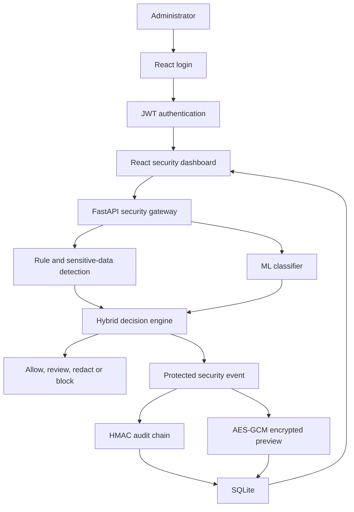

# PromptShield

[](https://github.com/sreemanbondada-sudo/PromptShield/actions/workflows/ci.yml)

PromptShield is an explainable security gateway that analyzes user prompts before they reach an AI application. It combines deterministic security rules, sensitive-data detection, machine learning, cryptographic protection, authenticated administration and tamper-evident logging through a FastAPI backend and React dashboard.

## Project Status

The backend security platform, expanded machine-learning pipeline and authenticated React dashboard are operational.

- 149 backend tests passing
- 31 frontend tests passing
- JWT administrator authentication for protected API routes
- Hybrid rule-based and machine-learning detection
- Sensitive-data detection and redaction
- HMAC-SHA-256 integrity verification
- AES-256-GCM encrypted storage
- Tamper-evident SQLite audit chain
- Multi-source ML training and independent evaluation
- ScamBench candidate-model research
- API rate limiting and request-size protection
- CORS, security headers and privacy-safe error handling
- Interactive React security dashboard
- Security statistics and activity visualizations
- Searchable and filterable security-event history
- Privacy-aware security-event investigation
- Audit-chain integrity monitoring
- GitHub Actions continuous integration

## Features

### Administrator authentication

PromptShield protects its security operations using administrator authentication and signed JSON Web Tokens.

The authentication design includes:

- Argon2 administrator-password hashing
- HMAC-SHA-256 JWT signing
- Configurable administrator credentials
- Constant-time username comparison
- Thirty-minute access-token expiration
- Bearer-token validation for protected endpoints
- Session-token storage in the browser's `sessionStorage`
- Automatic removal of rejected or expired tokens
- Explicit dashboard sign-out
- Public health monitoring without authentication
- Startup validation of authentication configuration

The dashboard never stores the administrator password. The access token is stored only for the current browser session.

PromptShield currently supports one configured administrator account. Multi-user role-based access control is planned.

### React security dashboard

PromptShield includes a responsive React and Vite dashboard connected to the FastAPI backend.

The dashboard provides:

- Secure administrator sign-in and sign-out
- Authenticated API communication
- Expired-session handling
- Real-time prompt analysis
- API health monitoring
- Recommended actions and risk scores
- Machine-learning probability display
- Detection-source explanations
- Matched-pattern information
- Sensitive-data redaction previews
- Security statistics
- Action and category visualizations
- Audit-chain integrity status
- Recent security-event history
- Event search and action filtering
- Manual event refresh
- Loading, empty and safe error states
- Privacy-aware security-event investigation
- Matched-pattern and audit-hash inspection

### Security-event investigation

Each recent security event can be opened in an investigation panel.

The investigation view displays:

- Event ID
- Creation timestamp
- Recommended action
- Risk score and level
- Security category
- Malicious classification
- Sensitive-data status
- Prompt length
- Matched rule patterns
- Sensitive-data types
- Previous audit-chain hash
- Current event hash

The event investigation view does not expose the original prompt contents.

### Prompt attack detection

PromptShield detects patterns associated with:

- Prompt injection
- Jailbreak attempts
- System-prompt extraction
- Role manipulation

The deterministic rule engine returns:

- Attack category
- Risk score and level
- Matched patterns
- Human-readable explanation
- Recommended action

### Sensitive-data protection

The sensitive-data detector recognizes:

- Email addresses
- Phone numbers
- API keys
- AWS access keys
- Private-key indicators
- Password assignments
- Secret assignments
- High-entropy secret-like strings

Sensitive values are replaced with `[REDACTED]` before protected previews are stored.

### Hybrid machine-learning detection

PromptShield includes a TF-IDF and Logistic Regression classifier using:

- Word n-grams
- Character n-grams
- Balanced classification weights
- Multiple prompt-security datasets
- Defensive hard-negative examples
- A configurable classification threshold

The main `/analyze` endpoint combines deterministic security rules, sensitive-data detection and machine-learning output.

Decision priority:

1. Rule-based attack: `block`
2. Sensitive data: `redact`
3. ML-only suspicion: `review`
4. No detection: `allow`

The machine-learning model is advisory. A rule-based attack always receives blocking priority.

## Machine-Learning Datasets

The production classifier is trained using:

- The original PromptShield development dataset
- Defensive and educational hard-negative prompts
- NeurAlchemy prompt-injection data
- Deepset prompt-injection data

Dataset preparation includes:

- Schema normalization
- Binary label conversion
- Duplicate removal
- Training and evaluation separation
- Cross-dataset overlap checking
- Prompt-length validation
- Source and license documentation

Detailed dataset information is available in [DATASET_SOURCES.md](DATASET_SOURCES.md).

### Production model

The production model uses:

- TF-IDF word features
- TF-IDF character features
- Logistic Regression
- Balanced class weights
- Classification threshold `0.55`

The expanded production model was trained on approximately 4,944 deduplicated examples.

Representative evaluation results:

| Evaluation dataset | Accuracy | Precision | Recall | F1 score |
|---|---:|---:|---:|---:|
| NeurAlchemy test | 95.44% | 96.53% | 95.65% | 96.09% |
| Deepset test | 78.45% | 94.87% | 61.67% | 74.75% |
| PromptShield challenge | 80.00% | 71.43% | 100.00% | 83.33% |

These measurements are development results and should not be interpreted as proof of production-level security.

### ScamBench research experiment

PromptShield includes a controlled research experiment using the English subset of `shaw/scambench-training`.

The preparation process:

- Streams the source dataset
- Selects English records
- Extracts only user-role messages
- Excludes system prompts
- Excludes assistant responses
- Excludes reasoning traces
- Limits prompts to 5,000 characters
- Creates balanced and deterministic subsets
- Removes cross-split duplicates
- Checks overlap with existing datasets

Prepared subsets:

| Split | Safe | Attack | Total |
|---|---:|---:|---:|
| Training | 4,000 | 4,000 | 8,000 |
| Validation | 500 | 500 | 1,000 |
| Test | 750 | 750 | 1,500 |

The isolated ScamBench candidate was evaluated separately from the production model.

At threshold `0.60`, representative candidate results were:

| Evaluation dataset | Accuracy | Precision | Recall | F1 score |
|---|---:|---:|---:|---:|
| NeurAlchemy test | 94.90% | 96.49% | 94.75% | 95.61% |
| Deepset test | 75.86% | 100.00% | 53.33% | 69.57% |
| ScamBench test | 85.13% | 87.48% | 82.00% | 84.65% |
| PromptShield challenge | 80.00% | 71.43% | 100.00% | 83.33% |

OR and weighted ensemble strategies were also evaluated.

The candidate and ensemble approaches were not promoted because they increased false positives or reduced performance on existing evaluation sets. The current production model remains unchanged.

This rejected experiment is intentionally documented because it demonstrates reproducible model evaluation instead of selecting a model using accuracy from only one dataset.

The candidate model binary is excluded from Git because it is an experimental generated artifact. It can be reproduced using the included training script.

## HMAC Integrity Verification

PromptShield uses HMAC-SHA-256 to verify that trusted messages and system prompts have not been modified.

Signature verification uses constant-time comparison to reduce timing-attack risk.

The HMAC secret is loaded from an environment variable and must not be committed to Git.

## AES-GCM Protected Storage

Redacted prompt previews are encrypted using AES-256-GCM before being stored in SQLite.

The protected-storage design provides:

- Confidentiality
- Ciphertext integrity
- Random nonce generation
- Event-specific authenticated context
- Detection of modified ciphertext
- Protection against ciphertext swapping

Original sensitive values are not stored.

There is intentionally no public endpoint that exposes decrypted prompt previews.

## Tamper-Evident Audit Chain

Every protected security event contains:

- The previous event hash
- Its own HMAC-SHA-256 event hash

Changing or rearranging protected event data breaks the audit chain and can be detected through the audit-verification API.

Legacy events that predate audit-chain support are reported separately.

## Privacy-Aware Event Storage

PromptShield stores security metadata such as:

- Risk level
- Risk score
- Attack category
- Recommended action
- Matched rule names
- Detection sources
- Machine-learning prediction
- Machine-learning probability
- Detected sensitive-data types
- Prompt length
- Encrypted redacted preview
- Audit hashes
- Creation timestamp

PromptShield does not store the original unredacted prompt.

## API Security Hardening

The backend includes:

- Administrator authentication
- Signed and expiring JWT access tokens
- Argon2 password verification
- Protected security and analysis endpoints
- Explicit CORS origins
- Security response headers
- Sliding-window rate limiting
- Request-body size limits
- Privacy-safe validation errors
- Safe unexpected-error responses
- Startup configuration validation
- Environment-based secret management
- SQLite foreign-key enforcement
- SQLite busy timeout
- SQLite WAL mode
- Explicit database transactions

The root, health and login endpoints remain public. Analysis, event, statistics, integrity, audit and standalone ML endpoints require a valid administrator bearer token.

The health endpoint remains outside the prompt-analysis rate limit so monitoring systems can continue checking API availability.

## Continuous Integration

PromptShield uses GitHub Actions to check every push and pull request targeting `main`.

The CI workflow automatically:

- Checks out the repository
- Installs Python dependencies
- Validates Python source files
- Runs the complete backend test suite
- Installs frontend dependencies with `npm ci`
- Runs the complete frontend test suite
- Runs ESLint
- Builds the production frontend bundle

The current CI status is displayed by the badge at the top of this README.

The workflow uses CI-only test credentials. Real application secrets are never committed to the repository.

## Architecture



Additional architecture documentation is available in [ARCHITECTURE.md](ARCHITECTURE.md).

## API Endpoints

| Method | Endpoint | Access | Purpose |
|---|---|---|---|
| GET | `/` | Public | Application status |
| GET | `/health` | Public | API health check |
| POST | `/auth/login` | Public | Administrator authentication and JWT issuance |
| POST | `/analyze` | Administrator | Hybrid prompt and sensitive-data analysis |
| POST | `/ml/analyze` | Administrator | Standalone ML classification |
| GET | `/events` | Administrator | Recent security events |
| GET | `/statistics` | Administrator | Security statistics |
| POST | `/integrity/verify` | Administrator | HMAC-SHA-256 verification |
| GET | `/audit/verify` | Administrator | Audit-chain verification |

Protected endpoints require this HTTP header:

```text
Authorization: Bearer <access-token>
```

Interactive API documentation is available while the backend is running:

```text
http://127.0.0.1:8000/docs
```

## Technology Stack

### Backend

- Python
- FastAPI
- Pydantic
- SQLite
- scikit-learn
- pytest
- PyJWT
- pwdlib with Argon2
- HMAC-SHA-256
- AES-256-GCM
- python-dotenv
- Hugging Face Datasets

### Frontend

- React
- Vite
- JavaScript
- CSS
- Vitest
- React Testing Library

### Development and automation

- Git
- GitHub
- GitHub Actions
- Visual Studio Code

### Planned infrastructure

- Cloud deployment

## Project Structure

```text
PromptShield/
├── .github/
│   └── workflows/
│       └── ci.yml
├── backend/
│   ├── data/
│   │   ├── external/
│   │   │   ├── deepset_train.csv
│   │   │   ├── deepset_test.csv
│   │   │   ├── neuralchemy_core_train.csv
│   │   │   ├── neuralchemy_core_validation.csv
│   │   │   ├── neuralchemy_core_test.csv
│   │   │   ├── scambench_train.csv
│   │   │   ├── scambench_validation.csv
│   │   │   └── scambench_test.csv
│   │   ├── challenge_prompts.csv
│   │   ├── hard_negative_prompts.csv
│   │   └── prompts.csv
│   ├── models/
│   │   ├── prompt_classifier.joblib
│   │   ├── metrics.json
│   │   ├── model_comparison.json
│   │   └── evaluation reports
│   ├── tests/
│   │   ├── test_auth_api.py
│   │   ├── test_auth_service.py
│   │   └── additional backend tests
│   ├── audit_service.py
│   ├── auth_dependencies.py
│   ├── auth_service.py
│   ├── config.py
│   ├── database.py
│   ├── detector.py
│   ├── encryption_service.py
│   ├── error_handlers.py
│   ├── evaluate_model.py
│   ├── evaluate_model_ensemble.py
│   ├── evaluate_scambench_candidate.py
│   ├── evaluate_thresholds.py
│   ├── evaluate_weighted_ensemble.py
│   ├── integrity_service.py
│   ├── main.py
│   ├── middleware.py
│   ├── ml_detector.py
│   ├── model_pipeline.py
│   ├── prepare_external_datasets.py
│   ├── prepare_scambench_dataset.py
│   ├── rate_limiter.py
│   ├── schemas.py
│   ├── sensitive_detector.py
│   ├── train_expanded_model.py
│   ├── train_model.py
│   ├── train_scambench_candidate.py
│   ├── validate_external_datasets.py
│   ├── validate_scambench_dataset.py
│   └── requirements.txt
├── frontend/
│   ├── public/
│   ├── src/
│   │   ├── components/
│   │   │   ├── AdminLogin.jsx
│   │   │   ├── AdminLogin.test.jsx
│   │   │   ├── RecentEvents.jsx
│   │   │   ├── RecentEvents.test.jsx
│   │   │   ├── SecurityBreakdown.jsx
│   │   │   └── SecurityBreakdown.test.jsx
│   │   ├── services/
│   │   │   ├── api.js
│   │   │   └── api.test.js
│   │   ├── test/
│   │   │   └── setup.js
│   │   ├── App.css
│   │   ├── App.jsx
│   │   ├── App.test.jsx
│   │   ├── index.css
│   │   └── main.jsx
│   ├── package.json
│   └── vite.config.js
├── .gitignore
├── ARCHITECTURE.md
├── DATASET_SOURCES.md
└── README.md
```

## Local Setup

### 1. Clone the repository

```powershell
git clone https://github.com/sreemanbondada-sudo/PromptShield.git
cd PromptShield
```

### 2. Create the backend virtual environment

```powershell
cd backend
py -m venv .venv
```

Activate it in PowerShell:

```powershell
Set-ExecutionPolicy -Scope Process -ExecutionPolicy Bypass
.\.venv\Scripts\Activate.ps1
```

### 3. Install backend dependencies

```powershell
python -m pip install -r requirements.txt
```

### 4. Configure environment variables

Create `backend/.env` based on `backend/.env.example`.

Generate an HMAC key:

```powershell
python -c "import secrets; print(secrets.token_urlsafe(32))"
```

Generate a Base64-encoded AES-256 key:

```powershell
python -c "import base64, secrets; print(base64.urlsafe_b64encode(secrets.token_bytes(32)).decode())"
```

Generate a JWT signing secret:

```powershell
python -c "import secrets; print(secrets.token_urlsafe(48))"
```

Generate an Argon2 administrator-password hash without displaying the password:

```powershell
python -c "from getpass import getpass; from pwdlib import PasswordHash; print(PasswordHash.recommended().hash(getpass('Administrator password: ')))"
```

Add the configuration to `.env`:

```env
PROMPTSHIELD_HMAC_KEY=your-private-hmac-key
PROMPTSHIELD_AES_KEY=your-base64-encoded-aes-key
PROMPTSHIELD_JWT_SECRET=your-private-jwt-secret
PROMPTSHIELD_ADMIN_USERNAME=admin
PROMPTSHIELD_ADMIN_PASSWORD_HASH=your-generated-argon2-password-hash
PROMPTSHIELD_ALLOWED_ORIGINS=http://localhost:5173,http://127.0.0.1:5173
PROMPTSHIELD_RATE_LIMIT_MAX_REQUESTS=30
PROMPTSHIELD_RATE_LIMIT_WINDOW_SECONDS=60
```

Never commit `.env`, share its secret values or place the plain administrator password in the file.

### 5. Train the production ML model

From the `backend` directory:

```powershell
python train_model.py
```

This uses the expanded production training pipeline.

### 6. Evaluate the production model

```powershell
python evaluate_model.py
python evaluate_thresholds.py
```

### 7. Validate external datasets

```powershell
python validate_external_datasets.py
python validate_scambench_dataset.py
```

### 8. Run backend tests

Run tests from the `backend` directory:

```powershell
python -m pytest -v
```

Current result:

```text
149 passed
```

One dependency deprecation warning may appear from FastAPI's current `TestClient` integration. It does not indicate a failed test.

### 9. Start the backend API

```powershell
python -m uvicorn main:app --reload
```

The backend will run at:

```text
http://127.0.0.1:8000
```

API documentation:

```text
http://127.0.0.1:8000/docs
```

Keep this terminal running.

### 10. Install frontend dependencies

Open a second PowerShell terminal:

```powershell
cd C:\Users\Sreeman\Documents\Projects\PromptShield\frontend
npm install
```

### 11. Run frontend tests

```powershell
npm test
```

Current result:

```text
31 passed
```

### 12. Run frontend quality checks

```powershell
npm run lint
npm run build
```

### 13. Start the React dashboard

```powershell
npm run dev
```

Open:

```text
http://localhost:5173
```

Sign in using the administrator username and the plain password used to create `PROMPTSHIELD_ADMIN_PASSWORD_HASH`.

The backend and frontend must both be running for the complete dashboard to work.

## Testing

### Backend testing

The backend test suite covers:

- Rule-based attack detection
- Safe-prompt handling
- Sensitive-data detection
- Secret redaction
- Entropy analysis
- FastAPI endpoints
- SQLite storage and statistics
- Database transaction behaviour
- HMAC generation and verification
- AES-GCM encryption and decryption
- Ciphertext tampering
- Ciphertext-swapping protection
- Audit-chain verification
- ML inference
- Hybrid decision priority
- CORS configuration
- Configuration validation
- Privacy-safe error handling
- Request-size limits
- Rate limiting
- Security headers
- External dataset preparation
- Dataset validation
- Temporary test-database isolation
- ScamBench user-message extraction
- Administrator credential verification
- Argon2 password hashing and verification
- JWT creation, validation and expiration
- Protected API endpoint authorization
- Invalid and expired token rejection

Current result:

```text
149 passed
```

### Frontend testing

The frontend test suite covers:

- Administrator login and logout
- Login failure handling
- Session-token storage
- Authorization headers
- Missing-session handling
- Expired-session handling
- Dashboard API integration
- API status rendering
- Prompt submission
- Prompt-analysis results
- Safe frontend error handling
- Recent-event rendering
- Sensitive-data status rendering
- Event search
- Action filtering
- Empty filter results
- Clearing filters
- Manual event refreshing
- Refresh failure handling
- Security breakdown visualizations
- Opening an event investigation
- Investigation metadata rendering
- Closing the investigation view
- API service functions

Current result:

```text
31 passed
```

## Reproducing the ScamBench Experiment

Prepare the controlled ScamBench subsets:

```powershell
python prepare_scambench_dataset.py
```

Validate the generated data:

```powershell
python validate_scambench_dataset.py
```

Train the isolated candidate:

```powershell
python train_scambench_candidate.py
```

Evaluate the candidate at the selected comparison threshold:

```powershell
python evaluate_scambench_candidate.py
```

Evaluate a simple OR ensemble:

```powershell
python evaluate_model_ensemble.py
```

Evaluate weighted ensemble configurations:

```powershell
python evaluate_weighted_ensemble.py
```

These commands do not replace the production model automatically.

## Security Limitations

PromptShield is currently an academic and portfolio project.

Current limitations include:

- Authentication currently supports one configured administrator rather than multi-user role-based access control
- Access tokens currently use fixed expiration without a refresh-token workflow
- Classical TF-IDF and Logistic Regression instead of a transformer model
- Limited manually curated PromptShield challenge data
- Dataset-specific language and annotation differences
- In-memory rate limiting that is not shared across multiple server instances
- No production identity provider
- No production key-management service
- No public encrypted-preview retrieval workflow
- SQLite is intended for local development
- Detection rules require continued evaluation against new attacks
- Model probabilities should not be interpreted as guaranteed security
- No security tool can reliably detect every unseen adversarial prompt

PromptShield should be used as one layer within a defense-in-depth security design.

Do not use the current version as the only security control protecting a production AI system.

## Responsible Dataset Use

PromptShield records dataset sources, licenses and transformations in `DATASET_SOURCES.md`.

Important practices include:

- Preserve required attribution
- Respect source-dataset licenses
- Avoid publishing private or sensitive information
- Sanitize secret-like values before committing datasets
- Keep training and evaluation splits separate
- Report negative results and model regressions
- Do not promote a candidate model based on one favourable metric
- Do not repeatedly tune against final test sets

The Guardian0369 Prompt-injection-and-PII dataset is not currently included because its licensing and schema require additional review.

## Roadmap

- Add multi-user role-based access control
- Add refresh-token rotation and session revocation
- Expand multilingual and obfuscated attack evaluation
- Evaluate additional clearly licensed prompt-security datasets
- Add stronger final holdout datasets
- Deploy the backend and frontend
- Add screenshots and demonstration material

## Author

Sreeman Bondada